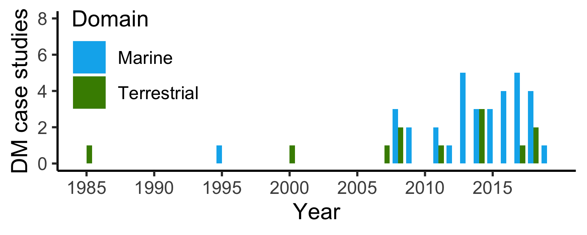
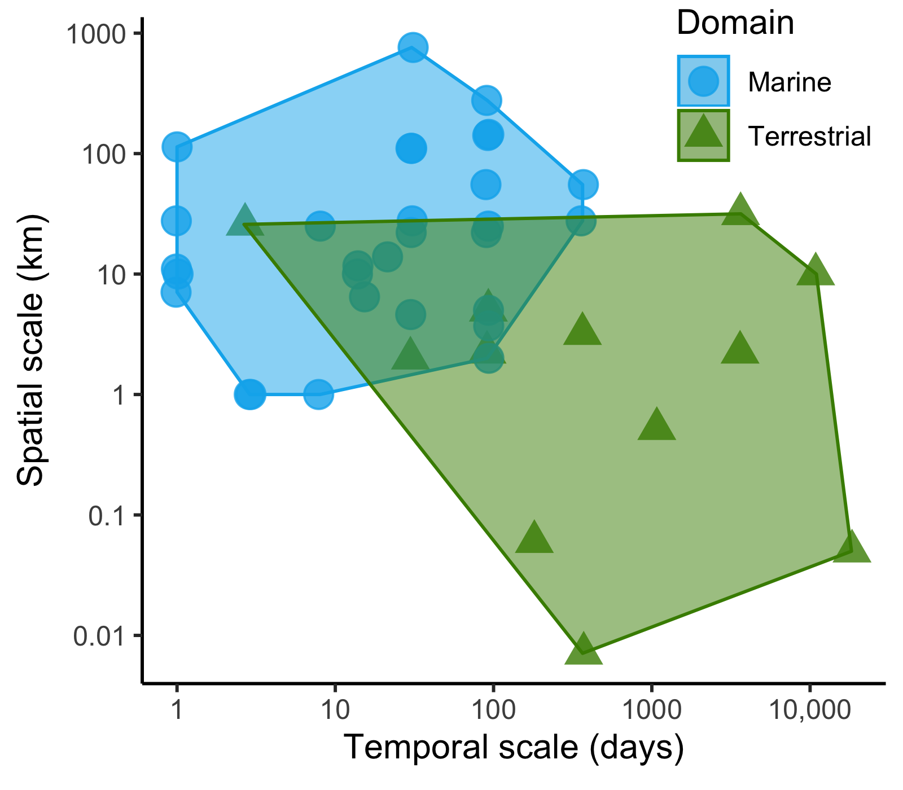
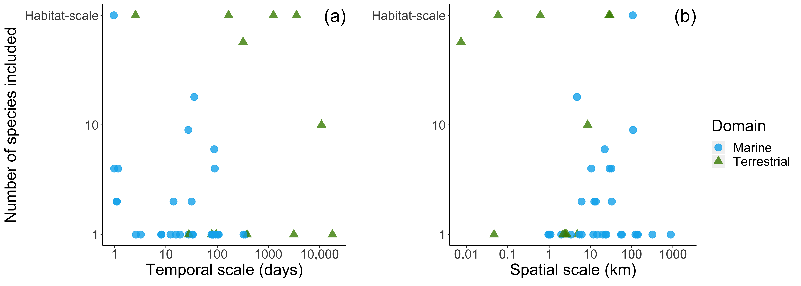

generate\_figures
================
6/18/2020

Generate figures for comparison of marine and terrestrial dynamic management case studies.

``` r
# Load necessary packages
library(tidyverse)
```

    ## ── Attaching packages ────────────────────────────────── tidyverse 1.2.1 ──

    ## ✔ ggplot2 3.2.1     ✔ purrr   0.3.2
    ## ✔ tibble  2.1.3     ✔ dplyr   0.8.3
    ## ✔ tidyr   1.0.0     ✔ stringr 1.4.0
    ## ✔ readr   1.3.1     ✔ forcats 0.4.0

    ## ── Conflicts ───────────────────────────────────── tidyverse_conflicts() ──
    ## ✖ dplyr::filter() masks stats::filter()
    ## ✖ dplyr::lag()    masks stats::lag()

``` r
library(plyr)
```

    ## -------------------------------------------------------------------------

    ## You have loaded plyr after dplyr - this is likely to cause problems.
    ## If you need functions from both plyr and dplyr, please load plyr first, then dplyr:
    ## library(plyr); library(dplyr)

    ## -------------------------------------------------------------------------

    ## 
    ## Attaching package: 'plyr'

    ## The following objects are masked from 'package:dplyr':
    ## 
    ##     arrange, count, desc, failwith, id, mutate, rename, summarise,
    ##     summarize

    ## The following object is masked from 'package:purrr':
    ## 
    ##     compact

``` r
library(reshape2)
```

    ## 
    ## Attaching package: 'reshape2'

    ## The following object is masked from 'package:tidyr':
    ## 
    ##     smiths

``` r
library(gridExtra)
```

    ## 
    ## Attaching package: 'gridExtra'

    ## The following object is masked from 'package:dplyr':
    ## 
    ##     combine

``` r
rm(list = ls())
```

Data Preparation
================

Read in "cases" CSV file from literature review

``` r
data<- read_csv("../data/cases.csv")  %>% 
  select(Domain, `Temporal scale (days)`, `Number of species`, `Spatial scale (km)`, Implementation, Year)
```

    ## Parsed with column specification:
    ## cols(
    ##   Program = col_character(),
    ##   Year = col_double(),
    ##   Domain = col_character(),
    ##   `Temporal scale (as described in paper)` = col_character(),
    ##   `Temporal scale (days)` = col_double(),
    ##   `Spatial scale (as described in paper)` = col_character(),
    ##   `Spatial scale (km)` = col_character(),
    ##   `Number of species` = col_character(),
    ##   Implementation = col_character(),
    ##   `Factors determining scale` = col_character(),
    ##   `Factors influencing ability to implement or succeed` = col_character(),
    ##   `Reference(s)` = col_character()
    ## )

Data cleaning for subsequent analysis

``` r
data$`Spatial scale (km)`[data$`Spatial scale (km)`=="Not explicitly defined"] <- NA
data$`Number of species`[data$`Number of species`=="Not explicitly defined"] <- NA
data$`Spatial scale (km)` <- as.numeric(data$`Spatial scale (km)`)
```

Figures
=======

Figure 3 - timeline of case studies
-----------------------------------

``` r
yearly_counts <- data.frame(Year = 1985:2019, Marine = numeric(35), Terrestrial = numeric(35))
for (i in 1985:2019) {
  yearly_counts$Marine[i-1984] <- sum(data$Year == i & data$Domain == "Marine")
  yearly_counts$Terrestrial[i-1984] <- sum(data$Year == i & data$Domain == "Terrestrial") 
}

Year = c((1985:2019),(1985:2019))
Count = c(yearly_counts$Marine,yearly_counts$Terrestrial)
Domain = c(rep("Marine",35),rep("Terrestrial",35))
df = data.frame(Year,Count,Domain)

ggplot(data = df, aes(x = Year, y = Count, fill = Domain)) + 
  geom_bar(stat = "identity", width = .8, position = "dodge") +
  scale_x_continuous(breaks = seq(1985, 2015, by = 5)) +
  scale_colour_manual(values = c("deepskyblue2", "Chartreuse4")) +
  scale_fill_manual(values = c("deepskyblue2", "Chartreuse4")) +
  ylab("DM case studies") +
  ylim(0,8) +
  theme(panel.background = element_rect(fill = "white", colour = "white") ,panel.border = element_blank(), panel.grid.major = element_blank(),
        panel.grid.minor = element_blank(), axis.line = element_line(colour = "black")) + 
  theme(legend.position = c(0.15, 0.7))
```



Figure 4 - spatial vs. temporal scale
-------------------------------------

``` r
rm(Count, Domain, i, Year)

data<- data %>%
  select(Domain, `Temporal scale (days)`, `Spatial scale (km)`, Implementation, `Number of species`) %>%
  na.omit() 

data$`Temporal scale (days)` <- log10(data$`Temporal scale (days)`)
data$`Spatial scale (km)` <- log10(data$`Spatial scale (km)`)
data$`Number of species`[data$`Number of species` == 'Habitat'] <- '100'
data$`Number of species`[data$`Number of species` == '>100'] <- '100'
data$`Number of species` <- as.integer(data$`Number of species`)
data$`Number of species` <- log10(data$`Number of species`)

hull <- data %>%
  group_by(Domain) %>% 
  slice(chull(`Temporal scale (days)`, `Spatial scale (km)`))

data %>%
  ggplot(aes(`Temporal scale (days)`, `Spatial scale (km)`, colour = Domain, fill = Domain, shape = Domain)) +
  scale_colour_manual(values = c("deepskyblue2", "Chartreuse4")) +
  scale_fill_manual(values = c("deepskyblue2", "Chartreuse4")) +
  scale_shape_manual(values=c(19, 17)) +
  geom_point(size = 4, alpha = 0.8, position = position_jitter(w = 0.01, h = 0)) +
  geom_polygon(data = hull, alpha=.5) +
  scale_x_continuous(breaks=c(0,1,2,3,4),
                     labels=c("1","10","100","1000","10,000")) +
  scale_y_continuous(breaks=c(-2,-1,0,1,2,3),
                     labels=c("0.01","0.1","1","10","100","1000")) +  
  xlab(expression("Temporal scale (days)")) + 
  ylab(expression("Spatial scale (km)")) +
  theme(panel.background = element_rect(fill = "white", colour = "white"), panel.border = element_blank(), panel.grid.major = element_blank(),
        panel.grid.minor = element_blank(), axis.line = element_line(colour = "black")) + 
  theme(legend.position = c(0.85, 0.9))
```



Figure 5 - Number of species vs. spatial scale, temporal scale
--------------------------------------------------------------

``` r
# get_legend function from the following forum: 
# http://www.sthda.com/english/wiki/wiki.php?id_contents=7930
get_legend<-function(myggplot){
  tmp <- ggplot_gtable(ggplot_build(myggplot))
  leg <- which(sapply(tmp$grobs, function(x) x$name) == "guide-box")
  legend <- tmp$grobs[[leg]]
  return(legend)
}

clabs <- c("1","10","Habitat-scale")
p1 <- data %>%
  ggplot(aes(`Temporal scale (days)`, `Number of species`, colour = Domain, fill = Domain, shape = Domain)) +
  scale_colour_manual(values = c("deepskyblue2", "Chartreuse4")) +
  scale_shape_manual(values=c(19, 17)) +
  geom_point(size = 4, alpha = 0.8, position = position_jitter(w = 0.08, h = 0)) +
  xlab(expression("Temporal scale (days)")) + 
  ylab(expression("Number of species included")) +
  scale_x_continuous(breaks=c(0,1,2,3,4),
                     labels=c("1","10","100","1000","10,000")) +
  scale_y_continuous(breaks = c(0,1,2),
                     labels = clabs) + 
  annotate("text", label = "(a)", x = 4.3, y = 2, size = 8, colour = "black") +
  theme(panel.background = element_rect(fill = "white", colour = "white"), panel.border = element_blank(), panel.grid.major = element_blank(),
        panel.grid.minor = element_blank(), axis.line = element_line(colour = "black"), text = element_text(size=20))

p2 <- data %>%
  select(Domain, `Spatial scale (km)`, `Number of species`, Implementation) %>%
  na.omit() %>%
  ggplot(aes(`Spatial scale (km)`, `Number of species`, colour = Domain, fill = Domain, shape = Domain)) +
  scale_colour_manual(values = c("deepskyblue2", "Chartreuse4")) +
  scale_shape_manual(values=c(19, 17)) +
  geom_point(size = 4, alpha = 0.8, position = position_jitter(w = 0.08, h = 0)) +
  xlab(expression("Spatial scale (km)")) + 
  ylab("") +
  theme(legend.position = "none") +
  scale_x_continuous(breaks=c(-2,-1,0,1,2,3),
                     labels=c("0.01","0.1","1","10","100","1000")) +
  scale_y_continuous(breaks = c(0,1,2),
                     labels = clabs) + 
  annotate("text", label = "(b)", x = 3.3, y = 2, size = 8, colour = "black") +
  theme(panel.background = element_rect(fill = "white", colour = "white"), panel.border = element_blank(), panel.grid.major = element_blank(),
        panel.grid.minor = element_blank(), axis.line = element_line(colour = "black"), text = element_text(size=20))

legend <- get_legend(p1)

p1 <- p1 + theme(legend.position = "none")

grid.arrange(p1, p2, legend, ncol=3, widths=c(7, 7, 2))
```


